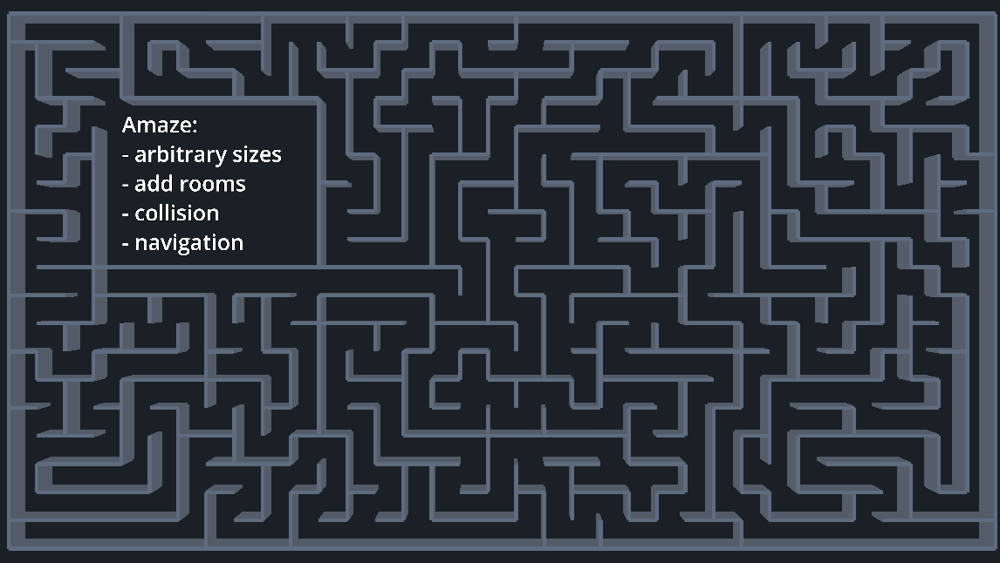

# Amaze generator 

Ported from 
[Maze Generator using unicode line drawing chars](http://www.vidarholen.net/~vidar/generatemaze.py) by 
[Vidar 'koala_man' Holen](http://www.vidarholen.net)

There's already a Godot add-on in the AssetLib that's probably better, but jsut had to scratch the itch.

